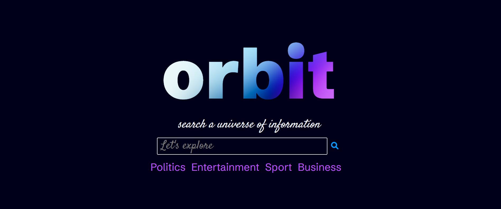

# Orbit 🚀

## Overview

Orbit is a search engine designed to provide users with an easy search experience. The interface presents users with a vibrant yet clean and minimalist design, with the primary focus on presenting search results, allowing users to quickly find the information they need.

## Screenshot

  

## Link to deployed site

[https://orbit-search.herokuapp.com/index.php](https://orbit-search.herokuapp.com/index.php)

## Technologies Used

- 
- 
- 